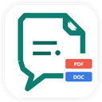

<p align="center">
  
</p>

<h1 align="center">ChatGPT2Doc</h1>

<p align="center"><strong>免费使用 · 本地处理 · 无订阅</strong></p>

<p align="center">把 ChatGPT 对话导出为可编辑 Word 文档和可搜索 PDF。</p>

<p align="center">
  <a href="README.md">English</a> ·
  <a href="docs/USAGE.md">使用说明</a> ·
  <a href="PRIVACY.md">隐私政策</a> ·
  <a href="LICENSE">许可证</a>
</p>

## 可以做什么

ChatGPT2Doc 会在 ChatGPT 页面中直接加入 DOCX 和 PDF 操作，可以导出：

- 单条助手回复；
- 完整对话；
- 不包含用户提示的仅助手内容；
- 自己勾选的部分消息。

导出时会尽量保留标题、列表、引用、链接、参考来源、表格、代码块、图片、中英文和数学公式。受支持的公式在 DOCX 中是可编辑的 Word 公式；PDF 文字可以搜索，并会内嵌所需字体。

所有文件都在本机生成，不需要 ChatGPT2Doc 账号、转换服务器、订阅、数据分析或遥测。

## 安装

### Chrome 应用商店

公开上架并通过审核后，会在这里加入商店直达链接。普通用户建议安装商店版本，以便 Chrome 自动更新。

源码和版本下载地址：

- [https://github.com/Throb7777/chatgpt2doc](https://github.com/Throb7777/chatgpt2doc)
- [https://github.com/Throb7777/chatgpt2doc/releases](https://github.com/Throb7777/chatgpt2doc/releases)

### 手动加载当前版本

1. 安装 Node.js 和 npm。
2. 在项目目录打开终端。
3. 运行：

   ```powershell
   npm ci
   npm run build:chrome
   ```

4. 打开 `chrome://extensions`。
5. 开启“开发者模式”。
6. 点击“加载已解压的扩展程序”。
7. 选择 `.output/chrome-mv3`。
8. 打开或刷新 `https://chatgpt.com/`。

Edge 用户运行 `npm run build:edge`，然后在 `edge://extensions` 中加载 `.output/edge-mv3`。

## 导出文档

### 导出单条回复

把鼠标移到一条助手回复附近，点击该回复旁的 DOCX 或 PDF 图标。文件只包含这条回复。

### 导出完整对话

点击浮动胶囊中的 DOCX 或 PDF 图标。消息会按照页面中的可见顺序导出。

### 只导出助手回复

1. 点击浮动胶囊中的齿轮。
2. 关闭“包含用户提示”。
3. 从浮动胶囊导出完整对话。

用户问题会被排除，助手回复仍保持原来的顺序。

### 导出部分消息

1. 从浮动胶囊进入“选择消息”。
2. 勾选需要的用户消息或助手回复。
3. 点击底部操作栏中的 DOCX 或 PDF。
4. 完成后退出选择模式。

没有勾选消息时不能导出。如果 ChatGPT 还在生成回复，请先等生成结束。

## 导出进度和警告

同一时间只会运行一个导出任务。导出过程中会显示当前处于内容收集、文档生成还是下载阶段，也可以在下载前取消。成功提示会自动关闭。

默认情况下，正常导出只提示“已完成”。如果希望查看图片不可用、公式不支持、内容收集不完整或可见回退等详细信息，可以在设置中开启“显示导出诊断”。

出现回退不代表整个文件导出失败，只表示对应内容无法完整保留原来的结构。

## 把公式复制到 Microsoft Word

默认复制目标是 **Microsoft Word**，不需要安装 helper：

1. 在一条 ChatGPT 消息内选中文字和公式。
2. 按 `Ctrl+C`。
3. 正常粘贴到 Microsoft Word。

在受支持的 Windows Word 版本中，受支持的公式会变成可编辑的 Word 公式。选择“仅保留文本”粘贴时，公式结构会被主动去除。

## 把可编辑公式复制到 WPS Writer

WPS 使用不同的本机剪贴板格式，因此可编辑 WPS 公式需要可选的 Windows helper。

1. 按照 [WPS helper 说明](native/wps-helper/README.md) 为当前扩展 ID 构建并安装 helper。
2. 打开 ChatGPT2Doc 设置。
3. 把“复制目标”改为 **WPS Office**。
4. Chrome 询问时允许可选的 Native Messaging 权限。
5. 点击“重新检查”，直到 helper 状态显示可用。
6. 在一条 ChatGPT 消息中选择内容并按 `Ctrl+C`。
7. 粘贴到 WPS Writer。

结构受支持时，公式会保持可编辑。如果 helper 不可用，ChatGPT2Doc 会安全回退到普通的 Word 兼容剪贴板。DOCX 和 PDF 导出始终不依赖 helper。

## 设置说明

点击浮动胶囊中的齿轮，可以调整：

- **语言：**英文或简体中文。
- **文件名：**留空时使用对话标题和时间。
- **纸张：**A4 或 Letter。
- **文档主题：**浅色或深色。
- **代码样式：**跟随文档、浅色或深色。
- **包含用户提示：**决定整段对话导出时是否包含用户问题。
- **显示导出诊断：**显示详细警告和回退信息。
- **每条回复操作：**显示或隐藏助手回复旁的按钮。
- **复制目标：**Microsoft Word 或 WPS Office。
- **胶囊位置：**直接拖动浮动胶囊，位置会自动记住。

点击“重置设置”可以恢复默认值。所有偏好只保存在浏览器本地。

## 常见问题

- **页面上没有导出按钮：**安装或重新加载扩展后刷新 ChatGPT，并确认扩展已获准在 `chatgpt.com` 上运行。
- **导出一直没有结束：**先等当前回复生成完成，然后取消并重新导出一次；不要同时启动多个任务。
- **公式显示为回退内容：**开启导出诊断，检查对应公式。如果使用了暂不支持的写法，应保留可见回退。
- **图片没有嵌入：**浏览器可能无法读取或解码图片来源；扩展会尽量保留链接或可见提示。
- **WPS helper 不可用：**确认设置中显示的扩展 ID，用该 ID 重新安装 helper，允许可选权限后再点“重新检查”。
- **Chrome 提示没有 manifest：**重新运行 `npm run build:chrome`，加载 `.output/chrome-mv3`，不要加载项目根目录。

## 隐私

对话内容只会在你主动导出或复制时在本机处理。ChatGPT2Doc 不会把对话上传给开发者，也不包含跟踪功能。对话中已有的远程图片可能会从原地址读取，以便嵌入文档。详细说明见 [PRIVACY.md](PRIVACY.md)。

## 开发与验证

```powershell
npm ci
npm run check
npm run build:chrome
npm run build:edge
npm run release:readiness
npm run release:package
```

未打包构建位于 `.output/`，发布 ZIP 位于 `release/v1.0.0/`。

## 许可证

ChatGPT2Doc 可以免费使用。源码采用 [PolyForm Noncommercial License 1.0.0](LICENSE)：允许个人、研究、教育及其他非商业用途；商业使用需要另行获得许可。第三方组件继续使用各自的许可证，详见 [THIRD_PARTY_NOTICES.md](THIRD_PARTY_NOTICES.md)。
